Armemos receptores GNSS en el IGU
================
José Ramón Martínez Batlle jmartinez19@uasd.edu.do

## Código QR de este repo

# Descripción general del curso

Curso práctico de 20 horas (5 días, 4 horas por día) orientado al
**diseño, ensamblaje, configuración y prueba de receptores GNSS de bajo
costo**, con enfoque modular y expandible.

El curso está diseñado bajo metodología *hands-on*, donde cada grupo
(idealmente de 3 participantes) ensamblará un equipo funcional modelo,
que podría ser cualquiera de los siguientes tipos:

- Base fija interior
- Base móvil
- Rover

La teoría se concentra en una sesión inicial breve para comprender los
fundamentos científicos y técnicos que justifican el diseño.

------------------------------------------------------------------------

# Objetivos del curso

Al finalizar el curso, el/la participante será capaz de:

- Comprender los fundamentos físicos y matemáticos del posicionamiento
  satelital.
- Diferenciar entre GPS, GLONASS, Galileo, BeiDou y otros sistemas GNSS.
- Identificar los componentes esenciales de un receptor GNSS.
- Ensamblar correctamente un receptor GNSS modular.
- Implementar sistema de alimentación autónoma.
- Configurar el software base (RTKLIB / RTKBase / BashRTKStation).
- Realizar pruebas de funcionamiento y transmisión NTRIP.

------------------------------------------------------------------------

# Estructura del curso

## Día 1 – Fundamentos y arquitectura del sistema (4 horas)

### Hora 1 – Teoría mínima indispensable

#### 1. ¿Qué es un sistema de posicionamiento?

- Trilateración
- Tiempo de viaje de la señal
- Sincronización reloj satélite-receptor
- Concepto de error

#### 2. Ciencia que lo explica

- Geodesia
- Sistemas de referencia (ITRF vs WGS84)
- Correcciones diferenciales
- RTK y PPK

#### 3. Sistemas GNSS

- GPS (EE.UU.)
- GLONASS (Rusia)
- Galileo (UE)
- BeiDou (China)

#### 4. Aplicaciones

- Topografía
- Monitoreo estructural
- Geodinámica
- Agricultura de precisión
- Estaciones permanentes
- Otras

------------------------------------------------------------------------

### Horas 2–4 – Introducción al proyecto práctico

- Presentación de componentes físicos
- Arquitectura general del sistema
- Esquema modular:

<!-- -->

    Antena → Receptor GNSS → Unidad de cómputo → Red / almacenamiento
                      ↑
                  Sistema de energía

- Organización de grupos
- Asignación de kits

------------------------------------------------------------------------

## Día 2 – Ensamblaje del sistema electrónico

### Objetivo del día

Lograr el ensamblaje funcional del núcleo:

- Receptor
- Raspberry / SBC
- Sistema de alimentación

### Actividades

1.  Identificación de pines y conectores
2.  Soldadura de cables
3.  Crimpado de conectores JST
4.  Instalación del BMS
5.  Integración batería + step-up/down
6.  Prueba de voltajes con multímetro
7.  Encendido inicial seguro

------------------------------------------------------------------------

## Día 3 – Integración física y montaje en caja

### Objetivo del día

Construir sistema estable, ventilado y seguro.

### Actividades

- Perforación de caja
- Montaje de interruptor
- Instalación de conector SMA externo
- Fijación de módulos internos
- Disipación térmica
- Organización de cableado
- Prueba estructural

Discusión breve:

- Disipación pasiva
- Estanqueidad
- Consideraciones IP

------------------------------------------------------------------------

## Día 4 – Configuración de software y transmisión

### Objetivo del día

Lograr que el sistema:

- Lea observaciones GNSS
- Genere RINEX
- Transmita vía NTRIP

### Actividades

1.  Instalación de sistema operativo (si aplica)
2.  Configuración de RTKBase o RTKLIB
3.  Configuración de puerto serial
4.  Prueba de recepción satelital
5.  Visualización de constelaciones
6.  Registro de datos
7.  Envío a caster (rtk2go u otro)

Opcional avanzado: - Configuración de caster propio

------------------------------------------------------------------------

## Día 5 – Validación, pruebas de campo y expansión

### Objetivo del día

Validar precisión y explorar mejoras.

### Actividades

- Prueba estática comparativa
- Evaluación de coordenadas
- Discusión sobre:
  - Errores
  - Multipath
  - Geometría satelital
- Introducción a:
  - RTK
  - PPK
  - Redes de estaciones

### Cierre

Cada grupo presenta:

- Su diseño
- Problemas encontrados
- Mejoras futuras

------------------------------------------------------------------------

# Lista de materiales (“*bill of materials*”, BOM)

El BOM relaciona los componentes de un único kit. Cada kit se ha
concebido para ser económico, modular y replicable, con componentes
accesibles en plataformas internacionales, como AliExpress. Localmente
se podrían adquirir algunos componentes, pero la oferta es muy limitada.

Se intenta que en el curso haya al menos dos kits disponibles para que
los participantes puedan armar receptores GNSS completamente
funcionales. Si los y las participantes adquiriesen sus propios kits,
podrían llevarlos al curso para ensamblarlos y configurarlos. Los
precios indicados a continuación son sólo para referencia, porque
últimamente se ha evidenciado mucha la volatilidad en la disponibilidad
y costes de los componentes electrónicos.

## Núcleo GNSS

| Ítem                         | Precio (US\$) |
|:-----------------------------|--------------:|
| Raspberry Pi Zero W          |            15 |
| Receptor GNSS (UM980 u otro) |           120 |
| Antena GNSS tipo plato       |            55 |
| Cable coaxial corto MMCX–SMA |             2 |

------------------------------------------------------------------------

## Sistema de energía

| Ítem                         | Precio (US\$) |
|:-----------------------------|--------------:|
| Tres baterías 18650          |            15 |
| PCM protección batería       |             3 |
| BMS MCP73871                 |             3 |
| Step-up / step-down TPS63070 |             1 |

------------------------------------------------------------------------

## Integración

| Ítem                 | Precio (US\$) |
|:---------------------|--------------:|
| Interruptor          |             1 |
| Disipadores          |             5 |
| Caja                 |             5 |
| Tornillería y cables |            10 |

### **Total aproximado para un kit: 235 US\$ + 10% incertidumbre = 258.5 US\$**

------------------------------------------------------------------------

# Diseños posibles

## Base fija interior

- Receptor GNSS USB
- SBC o PC
- Antena de plato
- Alimentación estable

------------------------------------------------------------------------

## Base móvil

- Igual que base fija
- Caja IP
- Batería integrada
- Disipación reforzada

------------------------------------------------------------------------

## Rover

- Antena helix o plato
- SBC o microcontrolador
- Software BashRTKStation
- Transmisión NTRIP

------------------------------------------------------------------------

# Repositorios y recursos

- RTKLIB
- RTKBase
- BashRTKStation
- rtk2go.com
- Onocoy
- Geodnet

------------------------------------------------------------------------

# Metodología

Este curso sigue enfoque:

- Aprendizaje basado en problemas
- Construcción modular
- Diagnóstico técnico
- Autonomía técnica

------------------------------------------------------------------------

# Resultados esperados

Al finalizar el curso, cada grupo habrá construido un receptor GNSS
completamente funcional, expandible y replicable, listo para
aplicaciones reales en:

- Monitoreo continuo
- Levantamientos RTK
- Instalación de estaciones base
- Investigación geodésica

------------------------------------------------------------------------

# Figuras de apoyo

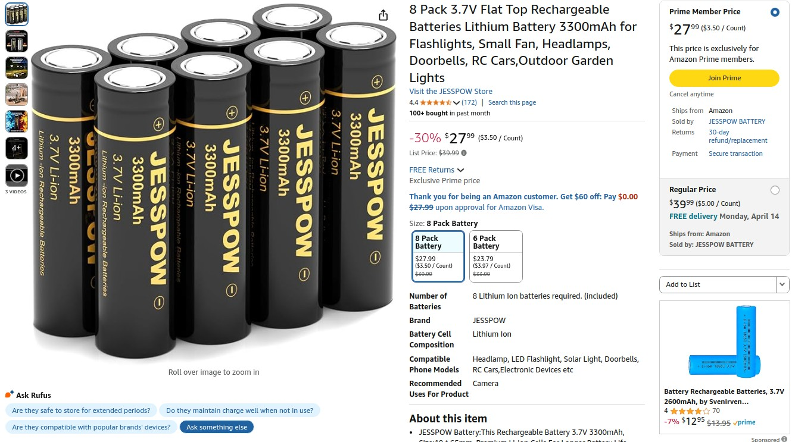

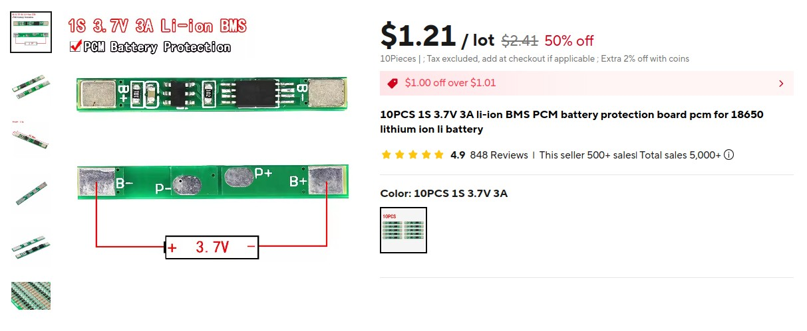

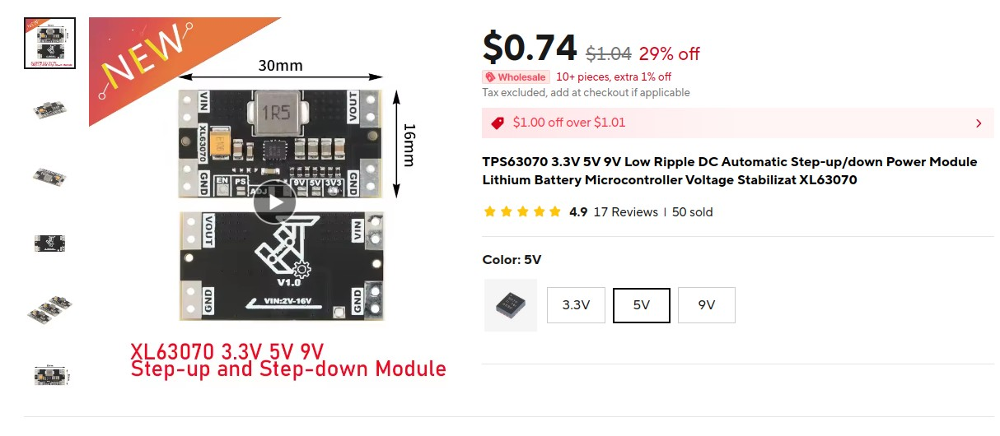

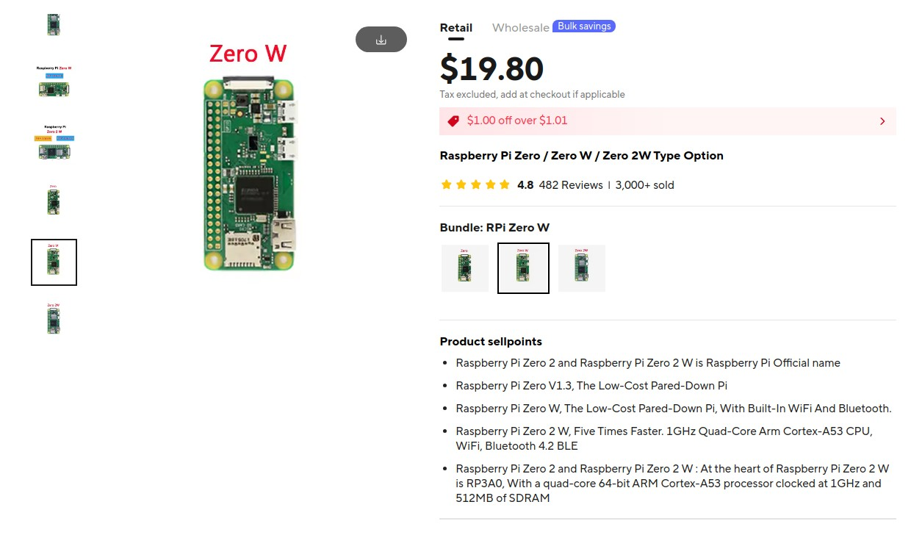

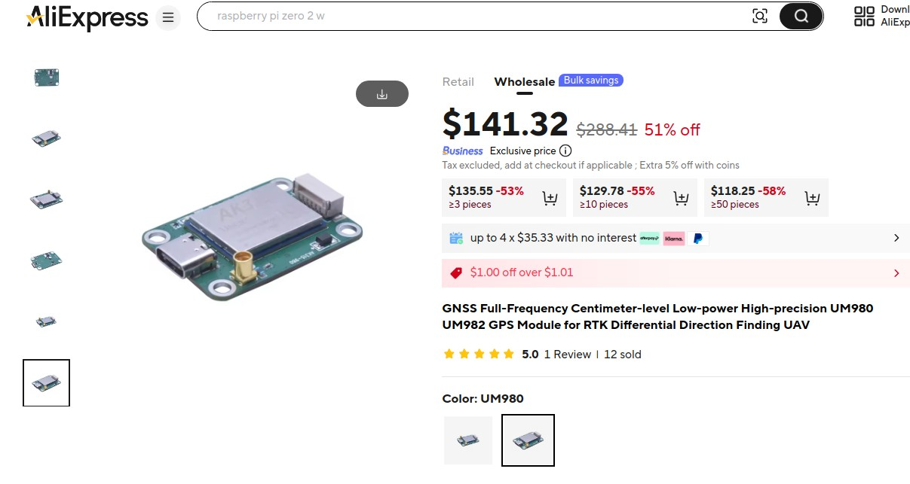

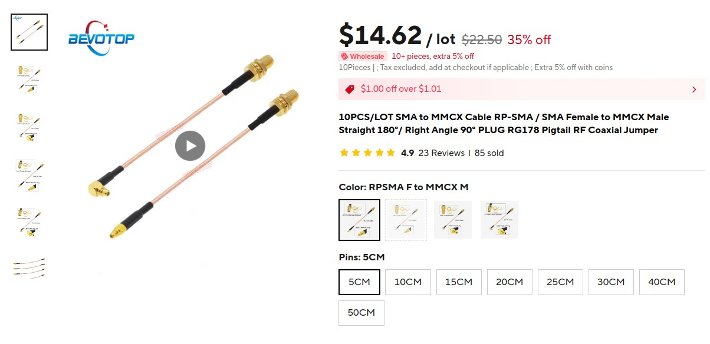

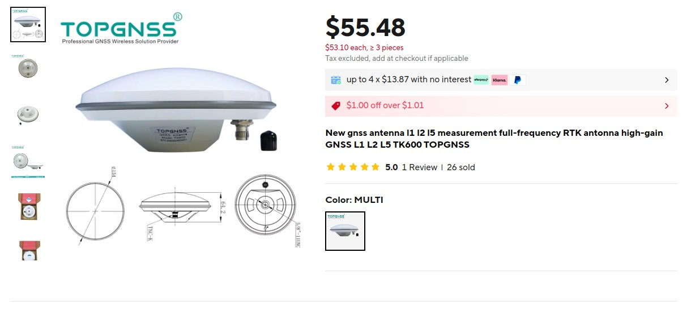

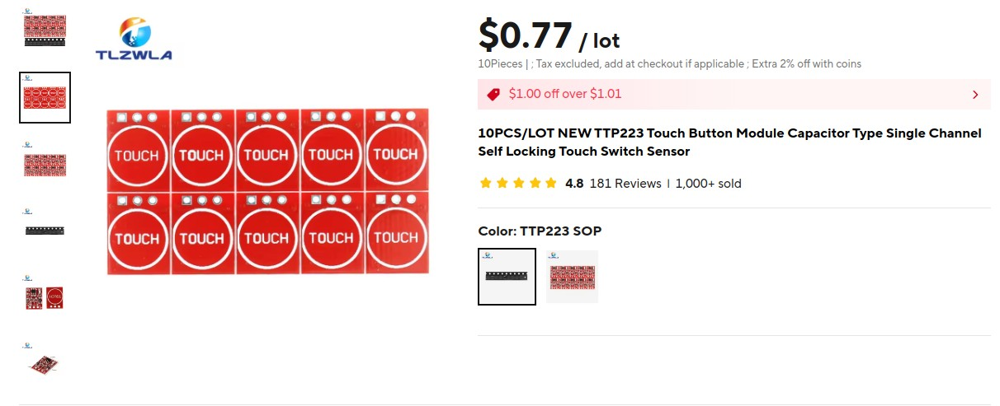

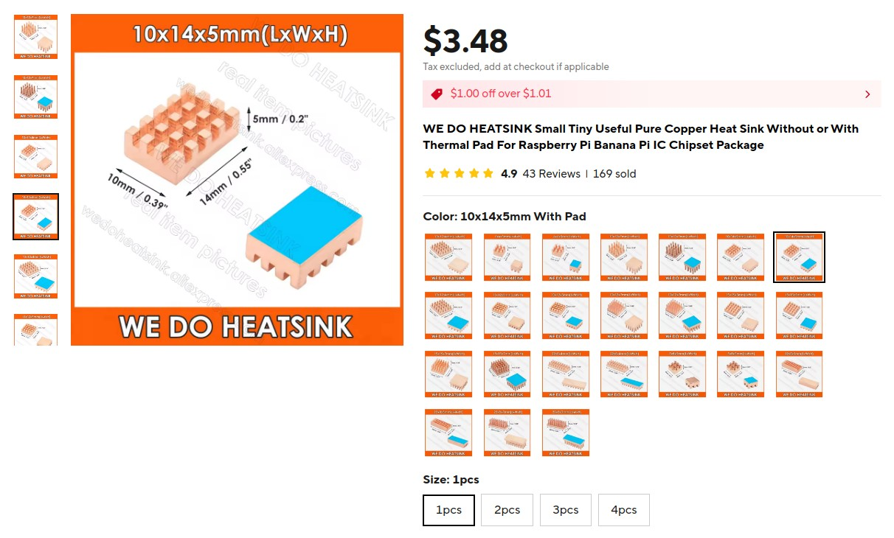

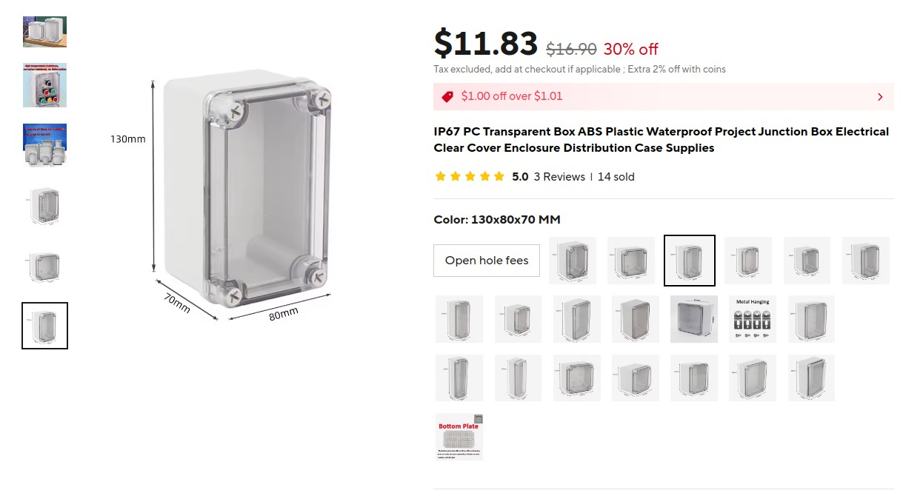

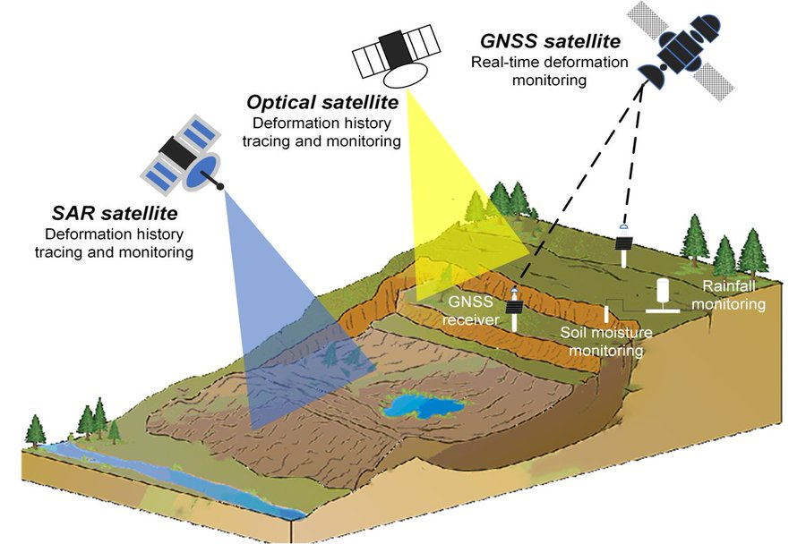

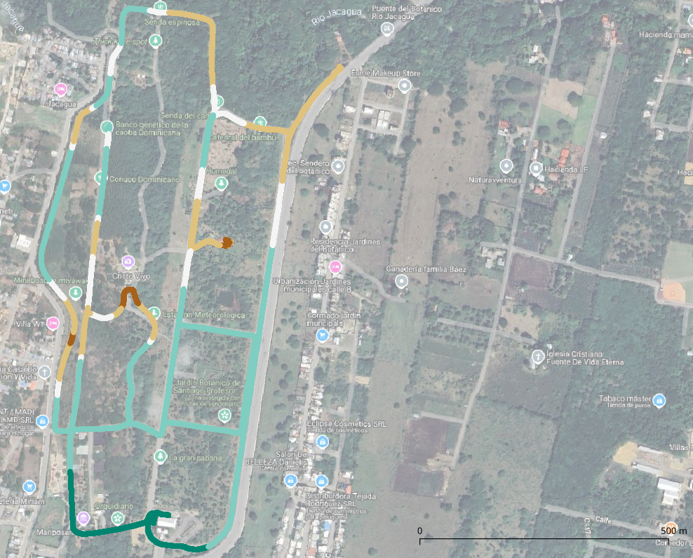

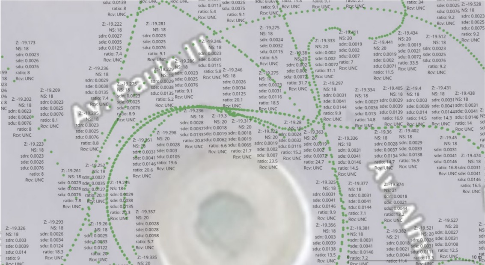

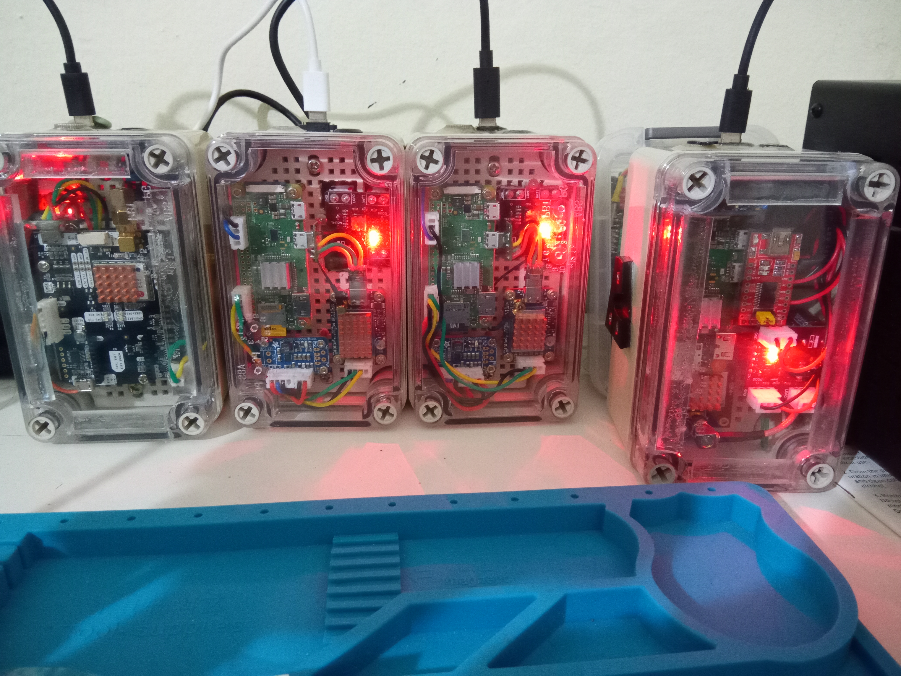

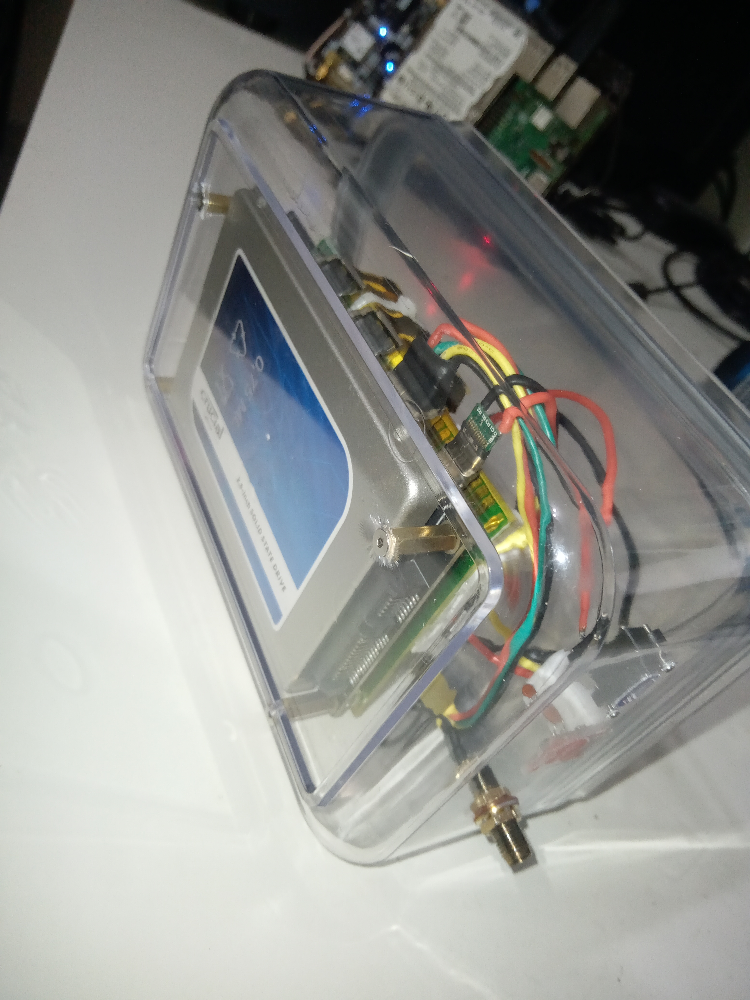

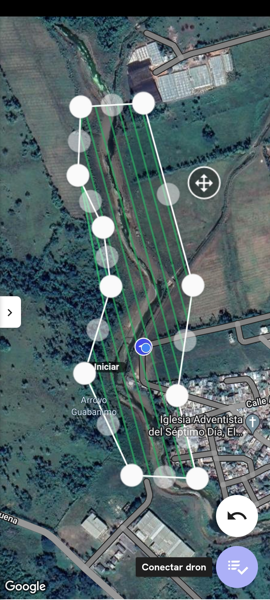

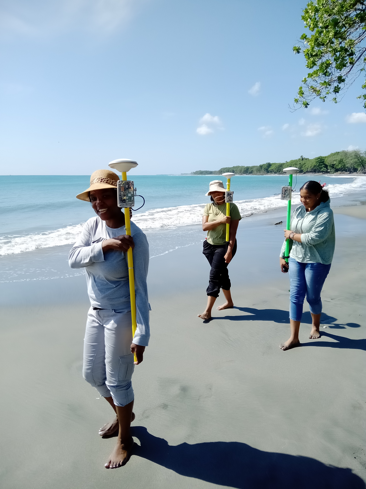

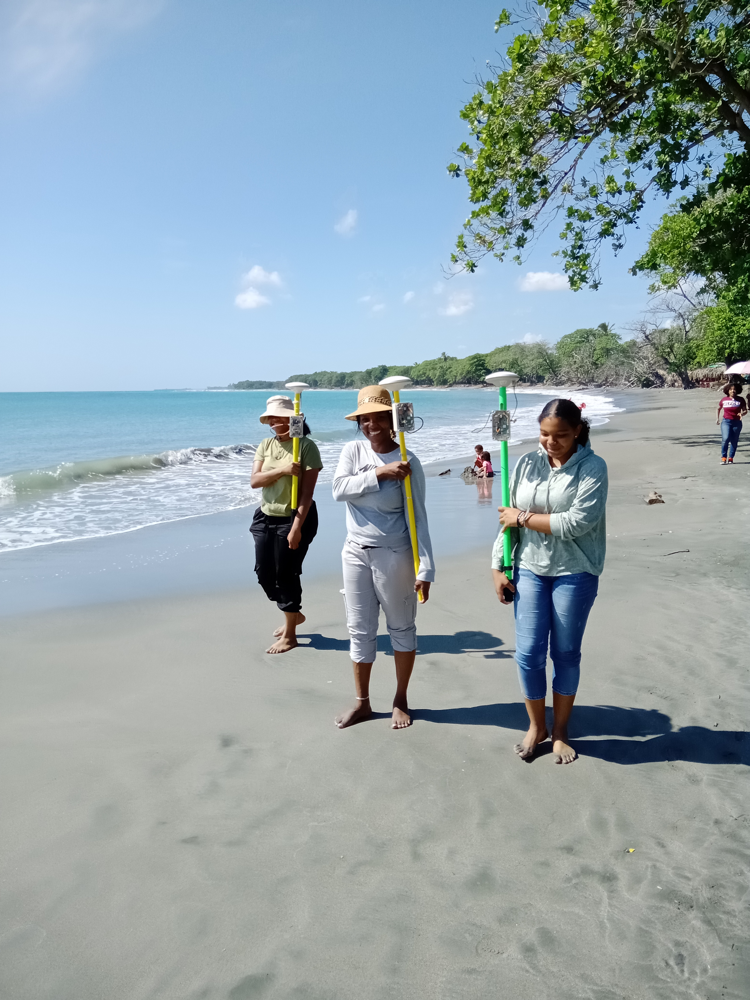

<!-- Ejecutar este comando después de generar el PDF -->

## Ver también

<https://geofis.github.io/mdt-campus-uasd-gnss-bajo-costo/presentaciones/III-Congreso-IDI-XXIII-JIC-nov24.html>
